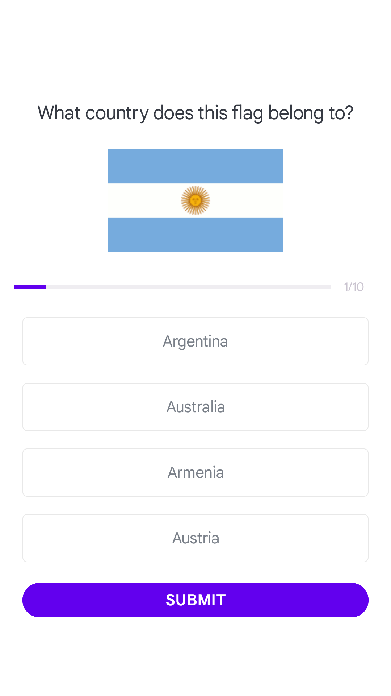
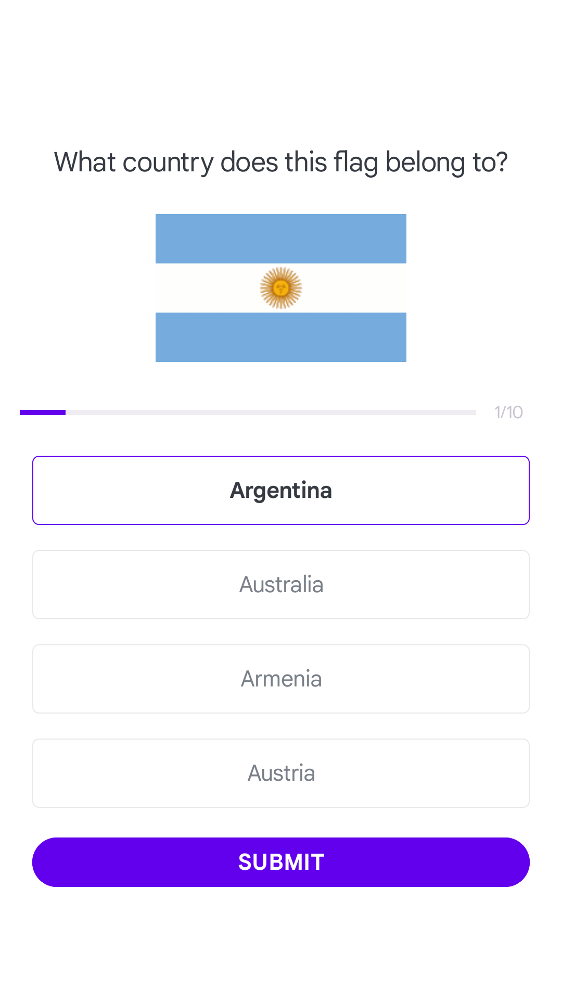
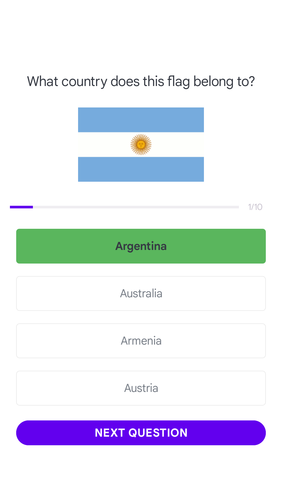
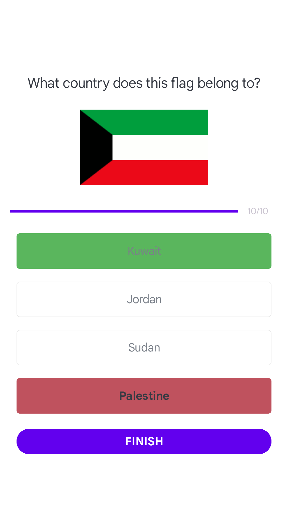

# QuizApp
Aplicativo Android de quiz sobre as bandeiras de países

## Objetivo
Acertar o país em que as bandeiras se referem e visualizar o resultado

## Funcionalidades
- Digitar seu nome/apelido
- Escolher uma opção e verificar resposta
- Visualizar a quantidade de acertos

## Linguagem
- Kotlin 
- XML

## Screenshots
     
